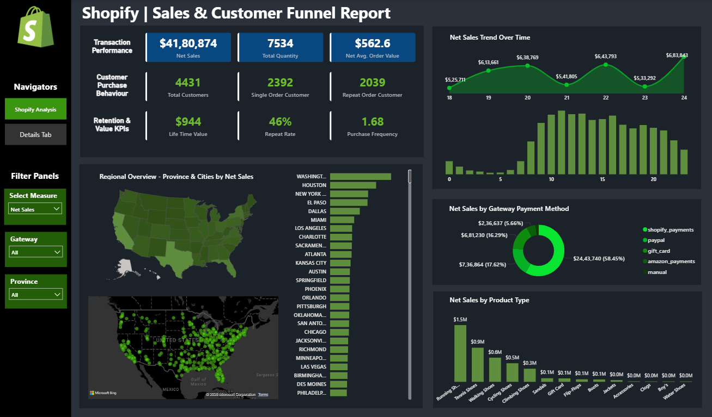
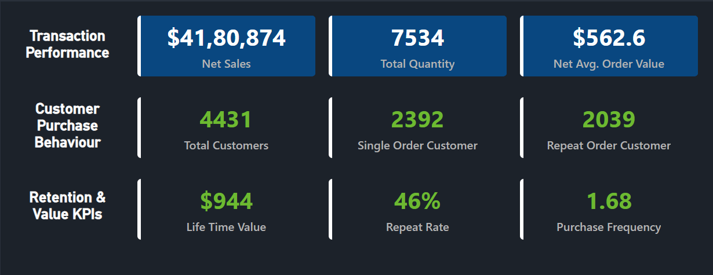

# Shopify Sales & Customer Funnel Analysis Dashboard

An end-to-end data analytics project built using Excel and Power BI to analyse sales performance, customer behaviour, and conversion funnel metrics for a Shopify e-commerce business.

## Project Overview

This project analyses Shopify sales and customer funnel data to identify:

- Revenue trends
- Customer purchasing behaviour
- Funnel conversion rates
- Top-performing products
- Sales by region
- Customer retention opportunities

The dashboard helps stakeholders make data-driven decisions to improve sales performance and customer acquisition strategies.

## Business Problem

E-commerce businesses generate large amounts of sales and customer data, but often struggle to answer:

- Which products generate the most revenue?
- Where are customers dropping off in the funnel?
- Which regions perform best?
- How can conversion rates be improved?
- Which customer segments drive revenue?

This dashboard provides actionable insights to answer these questions.

## Tools & Technologies

- Microsoft Excel
- Power BI
- Power Query
- DAX
- Data Visualization
- Business Intelligence

## Dataset

Source: Shopify Sales Dataset

Data includes:

- Orders
- Customers
- Revenue
- Products
- Regions
- Funnel Stages
- Sales Metrics

## Dashboard Features

### Sales Performance Analysis
- Total Revenue
- Total Orders
- Average Order Value
- Monthly Sales Trend

### Customer Analysis
- Customer Segmentation
- Repeat Customers
- New Customers

### Product Analysis
- Top Products
- Revenue Contribution
- Product Performance

## Dashboard Preview

### Executive Dashboard

### Customer Behaviour & Retention Analysis

### Sales Analysis

### Kpi Summary
 

## Key Insights

1. Top 20% products generated over 70% of total revenue.

2. The highest customer drop-off occurred between the Add-to-Cart and Checkout stages.

3. Returning customers showed higher average order values.

4. Revenue peaked during promotional periods.

5. Certain regions consistently outperformed others in conversion rates.

## Recommendations

- Improve checkout experience to reduce cart abandonment.
- Focus marketing spend on high-converting regions.
- Promote top-performing products through cross-selling.
- Introduce loyalty programs to increase customer retention.
- Optimize product pages with low conversion rates.

## Project Workflow

1. Data Collection
2. Data Cleaning
3. Data Transformation
4. Data Modelling
5. DAX Calculations
6. Dashboard Design
7. Insight Generation
8. Business Recommendations

