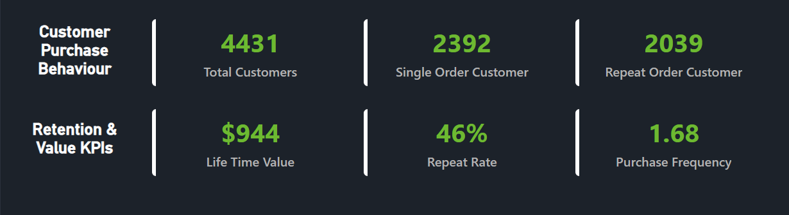
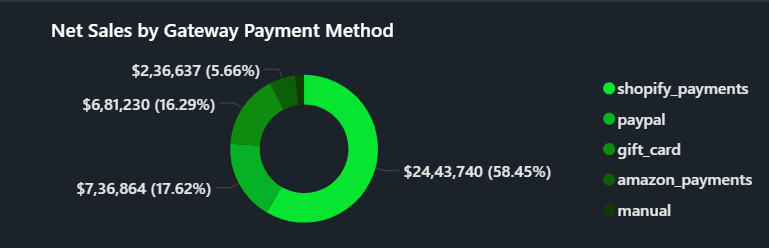
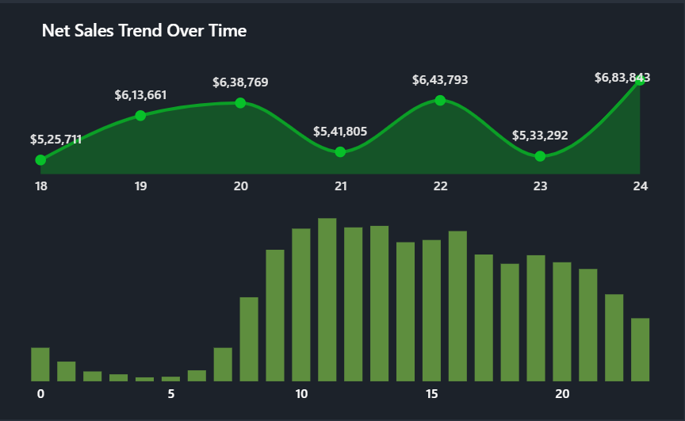
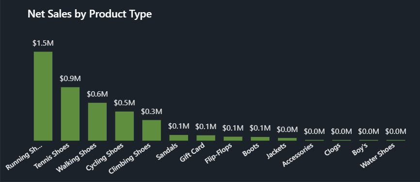

# Shopify Sales & Customer Funnel Analysis

An end-to-end business intelligence project built using **Excel** and **Power BI** to analyse sales performance, customer behaviour, and retention metrics for a Shopify e-commerce store.

---

## Project Overview

This project digs into one week of Shopify transaction data to answer a focused business question:

> *Which customers, products, and regions are actually driving revenue — and what should the business do about it?*

Rather than just reporting numbers, this dashboard was designed to surface decisions: where to invest marketing spend, which products to prioritise, and how to reduce lost revenue from one-time buyers.

---

## Business Problem

E-commerce teams often drown in raw order data without clarity on what's actually moving the needle. This project addresses three specific questions a Shopify business owner or analyst would genuinely ask:

- Are our customers coming back, or are we constantly acquiring new ones?
- Which products carry the business — and which ones are dead weight?
- Where geographically should we focus our sales and marketing efforts?

---

## Tools & Technologies

| Tool | Purpose |
|------|---------|
| Microsoft Excel | Data cleaning, transformation |
| Power BI | Dashboard development, DAX calculations |
| Power Query | Data modelling and shaping |
| DAX | Custom KPI calculations |

---

## Dataset

- **Source:** Shopify Sales Dataset
- **Period:** Single-week transaction snapshot
- **Records:** 5,000+ e-commerce transactions
- **Fields:** Orders, Customers, Products, Revenue, Regions, Funnel Stages

---

## Key Metrics

| Metric | Value |
|--------|-------|
| Customer Lifetime Value | $944 |
| Average Order Value | $562 |
| Repeat Purchase Rate | 46% |
| Total Customers Tracked | 4,431 |
| Top Region (Net Sales) | Washington — ~$100,000 |
| 2nd Region (Net Sales) | Houston — ~$90,000 |

---

## Key Insights

**1. Nearly half of all customers came back.**
A 46% repeat purchase rate is a strong retention signal. It means almost 1 in 2 customers liked their experience enough to order again — something many e-commerce stores struggle to achieve. The business should invest in keeping this segment loyal rather than over-spending on new customer acquisition.

**2. Two products alone carry 32% of total revenue.**
Running Shoes (20%) and Tennis Shoes (12%) together account for nearly a third of all sales. This is a concentration risk — if either product goes out of stock or faces a competitor, revenue takes a significant hit. The business should ensure these SKUs have priority inventory and consider expanding variants.

**3. Washington and Houston together dominate net sales.**
Washington (~$100K) and Houston (~$90K) are clearly the highest-converting markets. These regions deserve targeted promotions and loyalty campaigns. Regions performing significantly below these benchmarks should be investigated — is it a logistics issue, a visibility issue, or simply low demand?

**4. At $562 average order value, upselling has real potential.**
With a high AOV and $944 lifetime value per customer, even a small improvement in cross-selling complementary products (accessories, apparel) could meaningfully move revenue. The data suggests customers are willing to spend — the opportunity is in giving them more to buy.

**5. The biggest revenue leak is one-time buyers (54%).**
More than half of customers never returned. Even converting 10% of one-time buyers into repeat customers would add significant lifetime value at scale. Targeted email sequences or discount offers post-first-purchase could directly address this.

---

## Dashboard Preview

### Executive Dashboard

### Customer Behaviour & Retention Analysis

### Sales Analysis

### KPI Summary

---

## Dashboard Features

- **Drill-through navigation panels** — click into any segment for deeper analysis
- **Filter slicers** — cut by region, product category, customer type
- **Customer segmentation** — new vs. repeat buyer breakdown
- **Funnel stage tracking** — where customers drop off before completing purchase
- **DAX-powered KPIs** — lifetime value, AOV, repeat rate calculated dynamically

---

## Business Recommendations

1. **Protect the top products.** Running Shoes and Tennis Shoes are revenue-critical — maintain strong inventory and consider bundling them with accessories.
2. **Convert the 54% one-time buyers.** A simple post-purchase email campaign with a 10% return discount could significantly lift LTV.
3. **Double down on Washington and Houston.** These markets are proven — targeted regional promotions here have the highest ROI potential.
4. **Don't over-invest in low-performing regions yet.** Understand *why* they underperform before spending on them.
5. **Track AOV trends weekly.** At $562, small drops in AOV signal product mix problems before they hit total revenue.

---

## Project Workflow

1. Data ingestion from raw Shopify export
2. Data cleaning in Excel (null handling, type formatting, deduplication)
3. Data modelling in Power Query
4. DAX measures for LTV, AOV, repeat rate, funnel conversion
5. Dashboard design with drill-through and interactive slicers
6. Insight generation and business recommendations

---

## Author

**Harshit Kaishwar**
📧 kaishwarsid@gmail.com
🔗 [LinkedIn](https://www.linkedin.com/in/harshit-kaishwar-7286112b9)
🐙 [GitHub](https://github.com/Harshit-Kai)
